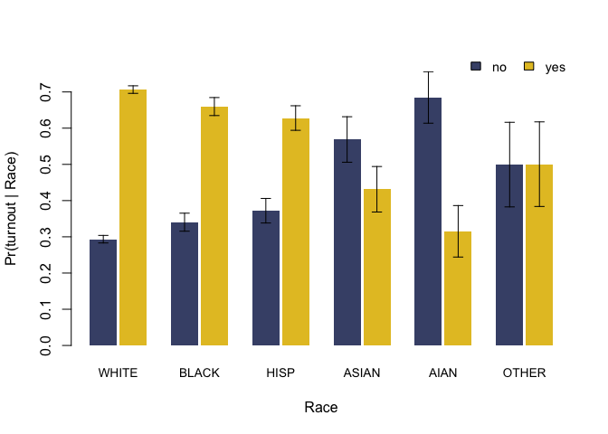

<!-- README.md is generated from README.Rmd. Please edit that file -->

# **BIRDiE**: Estimating disparities when race is not observed 

<!-- badges: start -->

[](https://github.com/CoryMcCartan/birdie/actions/workflows/R-CMD-check.yaml)
<!-- badges: end -->

Bayesian Instrumental Regression for Disparity Estimation (BIRDiE) is a
class of Bayesian models for accurately estimating conditional
distributions by race, using Bayesian Improved Surname Geocoding (BISG)
probability estimates of individual race. This package implements BIRDiE
as described in [McCartan, Goldin, Ho and Imai
(2022)](https://arxiv.org/abs/2303.02580). It also implements standard
BISG and an improved measurement-error BISG model as described in [Imai,
Olivella, and Rosenman
(2022)](https://www.science.org/doi/full/10.1126/sciadv.adc9824).


## Installation

You can install the development version of birdie from
[GitHub](https://github.com/) with:

``` r
# install.packages("remotes")
remotes::install_github("CoryMcCartan/birdie")
```

## Basic Usage

A basic analysis has two steps. First, you compute BISG probability
estimates with the `bisg()` or `bisg_me()` functions. Then, you estimate
the distribution of an outcome variable by race using the `birdie()`
function.

``` r
library(birdie)

data(pseudo_vf)

head(pseudo_vf)
#> # A tibble: 6 × 4
#>   last_name zip   race  turnout
#>   <fct>     <fct> <fct> <fct>  
#> 1 BEAVER    28748 white yes    
#> 2 WILLIAMS  28144 black no     
#> 3 ROSEN     28270 white yes    
#> 4 SMITH     28677 black yes    
#> 5 FAY       28748 white no     
#> 6 CHURCH    28215 white yes
```

To compute BISG probabilities, you provide the last name and
(optionally) geography variables as part of a formula.

``` r
r_probs = bisg(~ nm(last_name) + zip(zip), data=pseudo_vf)

head(r_probs)
#> # A tibble: 6 × 6
#>   pr_white pr_black pr_hisp pr_asian  pr_aian pr_other
#>      <dbl>    <dbl>   <dbl>    <dbl>    <dbl>    <dbl>
#> 1    0.956  0.00371  0.0103 0.000674 0.00886    0.0202
#> 2    0.162  0.795    0.0122 0.00102  0.000873   0.0292
#> 3    0.943  0.00378  0.0218 0.0107   0.000386   0.0202
#> 4    0.569  0.365    0.0302 0.00114  0.00108    0.0339
#> 5    0.971  0.00118  0.0131 0.00149  0.00118    0.0125
#> 6    0.524  0.315    0.0909 0.00598  0.00255    0.0610
```

Computing regression estimates requires specifying a model structure.
Here, we’ll use a Categorical-Dirichlet regression model that lets the
relationship between turnout and race vary by ZIP code. This is the
“no-pooling” model from McCartan et al. We’ll use bootstrapping to
approximately measure the uncertainty in our estimates.

``` r
fit = birdie(r_probs, turnout ~ proc_zip(zip), data=pseudo_vf, 
             family=cat_dir(), algorithm="em_boot")
#> Using weakly informative empirical Bayes prior for Pr(Y | R)
#> This message is displayed once every 8 hours.

print(fit)
#> Categorical-Dirichlet BIRDiE model
#> Formula: turnout ~ proc_zip(zip)
#>    Data: pseudo_vf
#> Number of obs: 5,000
#> Estimated distribution:
#>     white black  hisp asian  aian other
#> no  0.302 0.347 0.358 0.559 0.666 0.399
#> yes 0.698 0.653 0.642 0.441 0.334 0.601
```

The `proc_zip()` function fills in missing ZIP codes, among other
things. We can extract the estimated conditional distributions with
`coef()`. We can also get updated BISG probabilities that additionally
condition on turnout using `fitted()`. Additional functions allow us to
extract a tidy version of our estimates (`tidy()`) and visualize the
estimated distributions (`plot()`).

``` r
coef(fit)
#>         white     black      hisp    asian      aian     other
#> no  0.3019191 0.3467984 0.3579254 0.559023 0.6655915 0.3988616
#> yes 0.6980809 0.6532016 0.6420746 0.440977 0.3344085 0.6011384

head(fitted(fit))
#> # A tibble: 6 × 6
#>   pr_white pr_black pr_hisp pr_asian  pr_aian pr_other
#>      <dbl>    <dbl>   <dbl>    <dbl>    <dbl>    <dbl>
#> 1   0.962   0.00339 0.00974 0.000499 0.00581    0.0189
#> 2   0.0439  0.927   0.00821 0.000922 0.000897   0.0186
#> 3   0.942   0.00490 0.0228  0.00491  0.000331   0.0249
#> 4   0.579   0.362   0.0240  0.000860 0.000739   0.0329
#> 5   0.964   0.00145 0.0149  0.00251  0.00224    0.0146
#> 6   0.547   0.305   0.0886  0.00378  0.00141    0.0541

tidy(fit)
#> # A tibble: 12 × 3
#>    turnout race  estimate
#>    <chr>   <chr>    <dbl>
#>  1 no      white    0.302
#>  2 yes     white    0.698
#>  3 no      black    0.347
#>  4 yes     black    0.653
#>  5 no      hisp     0.358
#>  6 yes     hisp     0.642
#>  7 no      asian    0.559
#>  8 yes     asian    0.441
#>  9 no      aian     0.666
#> 10 yes     aian     0.334
#> 11 no      other    0.399
#> 12 yes     other    0.601

plot(fit)
```



A more detailed introduction to the method and software package can be
found on the [Get
Started](https://corymccartan.com/birdie/articles/birdie.html) page.
